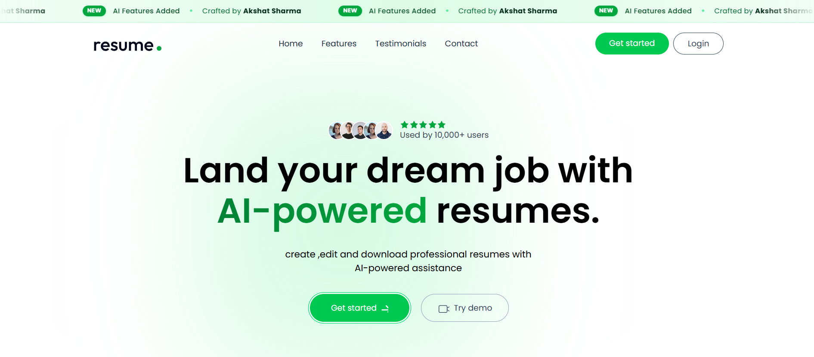
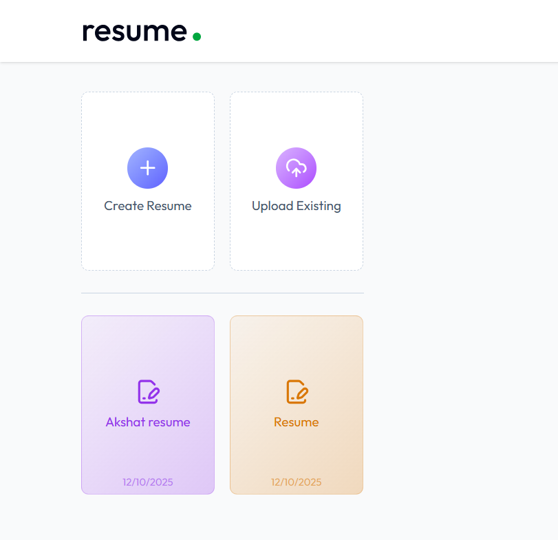
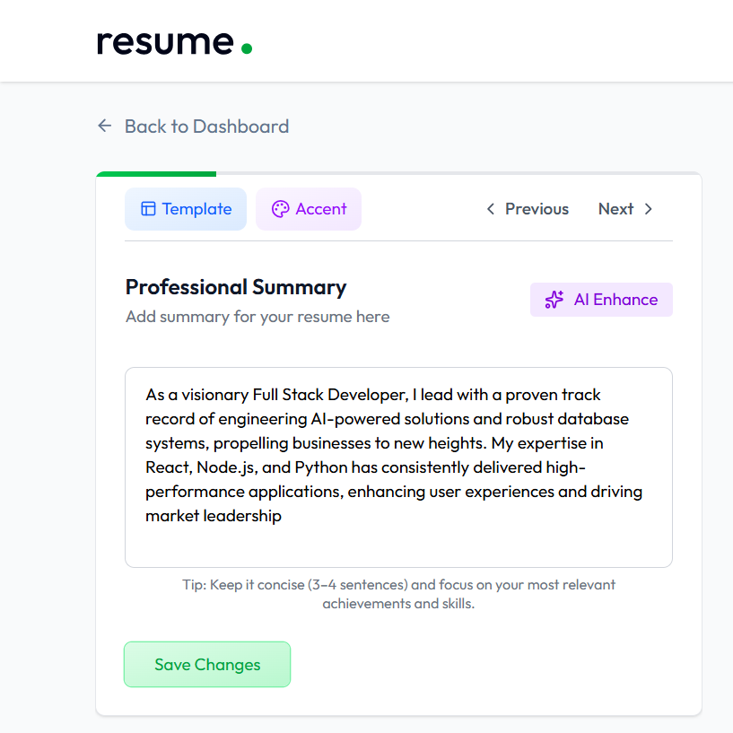
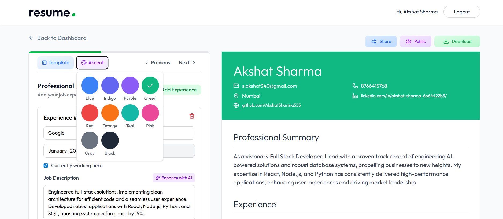
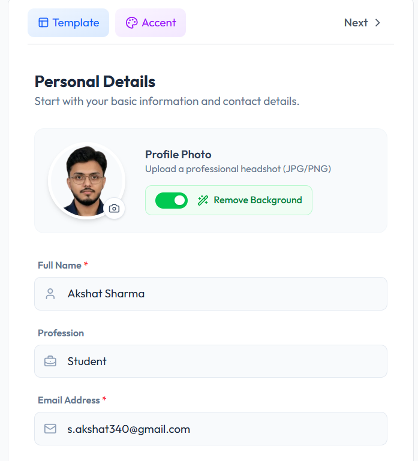

<p align="center" style="font-size:16px; color:#555;">
Welcome to the official repository for the <strong>AI Resume Builder</strong>. This is a complete full-stack MERN application built to revolutionize how professionals create resumes using Artificial Intelligence.
</p>

<p style="color:#555;">
The primary goal of this project is to provide an intelligent, ATS-friendly platform where users can generate high-impact professional summaries, optimize job descriptions, and export polished resumes in seconds—all powered by cutting-edge AI.
</p>

<p align="center">
  
</p>

<hr style="border:1px solid #C99A57;"/>

<h2 style="color:#1F2933;">✨ Features</h2>

<h3 style="color:#1F2933;">🤖 Advanced AI Intelligence:</h3>
<ul style="color:#555;">
  <li><strong>Smart Profile Picture Handling:</strong> Upload any raw photo—the AI automatically detects the face, auto-focuses, and <strong>removes the background</strong>, replacing it with a professional accent color that matches your resume theme.</li>
  <li><strong>AI Writing Assistant:</strong> Generates "High-Impact Executive Hooks" for professional summaries based on basic inputs.</li>
  <li><strong>Bullet Point Enhancer:</strong> Rewrites job descriptions using the "Action + Task + Result" formula.</li>
  <li><strong>Resume Parser:</strong> Upload an existing PDF, and the system extracts data (Experience, Education, Skills) into the builder automatically.</li>
</ul>

<h3 style="color:#1F2933;">Dynamic Resume Builder:</h3>
<ul style="color:#555;">
  <li><strong>Real-Time Preview:</strong> See changes instantly as you type with a split-screen editor.</li>
  <li><strong>Multiple Templates:</strong> Choose from Classic, Modern, Minimal, and Minimal Image designs.</li>
  <li><strong>Theme Customization:</strong> Dynamic accent color picker that updates text, icons, and image backgrounds instantly.</li>
  <li><strong>Instant PDF Export:</strong> High-quality, print-ready downloads compatible with ATS systems.</li>
</ul>

<h3 style="color:#1F2933;">User Experience & Security:</h3>
<ul style="color:#555;">
  <li><strong>Modern UI/UX:</strong> Built with Tailwind CSS for a sleek, responsive experience on all devices.</li>
  <li><strong>Secure Authentication:</strong> robust JWT-based login and signup system.</li>
  <li><strong>Dashboard:</strong> Centralized hub to manage multiple resumes (Create, Update, Delete).</li>
  <li><strong>Public Sharing:</strong> Generate unique public links for your resumes to share on LinkedIn or email.</li>
</ul>

<hr style="border:1px solid #C99A57;"/>

<h2 style="color:#1F2933;">📸 Screenshots</h2>

<table style="width:100%; border:none;">
  <tr>
    <td style="width:50%; padding:10px;">
      <p align="center" style="color:#555; font-weight:bold;">Dashboard & Builder</p>
      
    </td>
    <td style="width:50%; padding:10px;">
      <p align="center" style="color:#555; font-weight:bold;">AI Summary Generator</p>
      
    </td>
  </tr>
  <tr>
    <td style="width:50%; padding:10px;">
      <p align="center" style="color:#555; font-weight:bold;">Smart Image & Color Picker</p>
      
    </td>
    <td style="width:50%; padding:10px;">
      <p align="center" style="color:#555; font-weight:bold;">Personal Details</p>
      
    </td>
  </tr>
</table>

<hr style="border:1px solid #C99A57;"/>

<h2 style="color:#1F2933;">🛠️ Tech Stack</h2>

<h3 style="color:#1F2933;">Frontend:</h3>
<ul style="color:#555;">
  <li>React.js (Vite)</li>
  <li>Redux Toolkit (State Management)</li>
  <li>Tailwind CSS (Styling)</li>
  <li>Lucide React (Icons)</li>
  <li>Axios (API Communication)</li>
  <li>React PDF to Text (Parsing)</li>
</ul>

<h3 style="color:#1F2933;">Backend:</h3>
<ul style="color:#555;">
  <li>Node.js & Express.js</li>
  <li>RESTful API Architecture</li>
</ul>

<h3 style="color:#1F2933;">Database & Storage:</h3>
<ul style="color:#555;">
  <li>MongoDB (Database)</li>
  <li>Mongoose (ODM)</li>
  <li>ImageKit (Image Storage & Optimization)</li>
</ul>

<h3 style="color:#1F2933;">AI & Security:</h3>
<ul style="color:#555;">
  <li><strong>Cohere AI:</strong> (Command-R Model for Text Generation)</li>
  <li>JSON Web Tokens (JWT)</li>
  <li>Bcrypt (Password Security)</li>
  <li>Cors & Dotenv</li>
</ul>

<hr style="border:1px solid #C99A57;"/>

<h2 style="color:#1F2933;">🚀 Getting Started</h2>

<p style="color:#555;">Follow these instructions to set up and run the project on your local machine.</p>

### Prerequisites
- **Node.js**: Version 18.x or higher.
- **Git**: Required for cloning the repository.
- **MongoDB**: Local or Atlas connection string.

---

<h2 style="color:#1F2933;">🛠️ Installation & Setup</h2>

### 1. Clone the Repository
Open your terminal and run:

```
git clone [https://github.com/AkshatSharma555/ai-resume-builder.git](https://github.com/AkshatSharma555/ai-resume-builder.git)
```
```
cd ai-resume-builder
```
<h2 style="color:#1F2933;">🖥️ Backend Setup</h2>

Navigate to the Server Directory
```
cd server
```
Install Dependencies
```
npm install
```
Create the Environment Variable File (.env) Create a file named .env in the server directory and add your credentials:
```
PORT=3000
MONGO_URI=your_mongodb_connection_string
JWT_SECRET=your_secret_key

# AI Configuration
COHERE_API_KEY=your_cohere_key

# Image Configuration (ImageKit)
IMAGEKIT_PUBLIC_KEY=your_public_key
IMAGEKIT_PRIVATE_KEY=your_private_key
IMAGEKIT_URL_ENDPOINT=your_url_endpoint
```
Start the Backend Server
```
npm start
```
<h2 style="color:#1F2933;">🖥️ Frontend Setup</h2>

Navigate to the Client Directory Open a new terminal and run:
```
cd client
```
Install Dependencies
```
npm install
```
Create the Environment Variable File (.env) Create a file named .env in the client directory:
```
VITE_API_BASE_URL=http://localhost:3000
```
Start the Frontend
```
npm run dev
```
Open the displayed local URL (e.g., http://localhost:5173) to use the application.

<hr style="border:1px solid #C99A57; margin:30px 0;"/>

<h2 style="color:#1F2933;">🙏 Acknowledgements</h2> <p style="color:#555; font-size:15px;"> This project demonstrates the power of integrating Generative AI with full-stack web development. </p>

<p style="color:#555; font-size:15px;"> If you found this project helpful or interesting, please consider giving it a <span style="color:#C99A57;">⭐ Star</span> on GitHub. </p>

<p style="color:#555; font-size:15px; font-style:italic;"> Crafted by <strong>Akshat Sharma</strong> </p>
